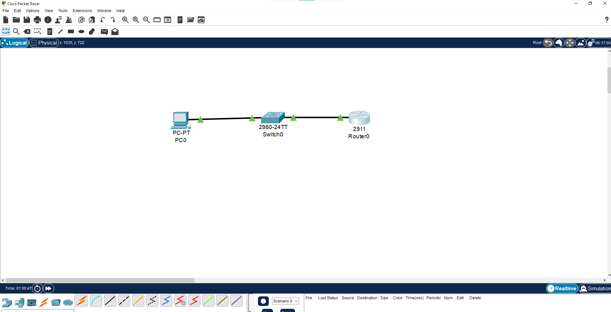
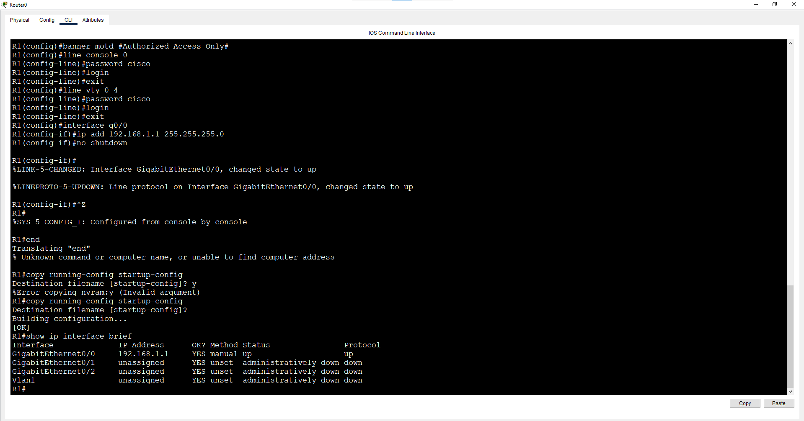

# Lab 1: Basic Device Configuration

**Week 1 - Lab 1** | Topic: Network Fundamentals & Addressing

## Objective
Configure a router and a switch with basic secure settings (hostname, passwords, banner, management IP) and verify end-to-end connectivity with a PC.

## Topology


`PC1 --- SW1 --- R1`

## Addressing Table
| Device | Interface | IP Address   | Subnet Mask   | Gateway     |
|--------|-----------|--------------|---------------|-------------|
| R1     | G0/0      | 192.168.1.1  | 255.255.255.0 | N/A         |
| SW1    | VLAN 1    | 192.168.1.2  | 255.255.255.0 | 192.168.1.1 |
| PC1    | NIC       | 192.168.1.10 | 255.255.255.0 | 192.168.1.1 |

## Steps

### 1. Configure the router (R1)
```
enable
configure terminal
hostname R1
no ip domain-lookup
enable secret <your-secret>
banner motd # Authorized Access Only #
line console 0
 password <console-password>
 login
 exit
line vty 0 4
 password <vty-password>
 login
 exit
interface g0/0
 ip address 192.168.1.1 255.255.255.0
 no shutdown
 exit
end
copy running-config startup-config
```

### 2. Configure the switch (SW1)
```
enable
configure terminal
hostname SW1
no ip domain-lookup
enable secret <your-secret>
banner motd # Authorized Access Only #
line console 0
 password <console-password>
 login
 exit
line vty 0 4
 password <vty-password>
 login
 exit
interface vlan 1
 ip address 192.168.1.2 255.255.255.0
 no shutdown
 exit
ip default-gateway 192.168.1.1
end
copy running-config startup-config
```

### 3. Configure PC1
IP `192.168.1.10`, mask `255.255.255.0`, gateway `192.168.1.1`.

## Verification
| Command | Run on | Expected result |
|---------|--------|-----------------|
| `show ip interface brief` | R1, SW1 | Interface/VLAN 1 is `up/up` with the correct IP |
| `ping 192.168.1.1` | PC1 | Replies from R1 |
| `ping 192.168.1.2` | PC1 | Replies from SW1 |
| `show running-config` | R1, SW1 | Hostname, banner and line settings present |



## Common Issues & Fixes
| Problem | Likely cause | Fix |
|---------|--------------|-----|
| Interface shows `administratively down` | Missing `no shutdown` | Run `no shutdown` on the interface |
| First ping times out, the rest succeed | ARP resolution on first packet | Normal behavior, ping again |
| Ping fails from PC1 | Wrong IP/mask/gateway on PC1 | Re-check the addressing table |
| Config lost after reload | Not saved | Run `copy running-config startup-config` |

## Files
- ./lab 1.pkt - Packet Tracer file
- 

## Lessons Learned
- Always set `enable secret` and avoid leaving default or empty passwords.
- A switch needs a management IP on VLAN 1 (and a default gateway) to be reachable remotely.
- Save the configuration with `copy running-config startup-config`, otherwise it is lost on reload.
