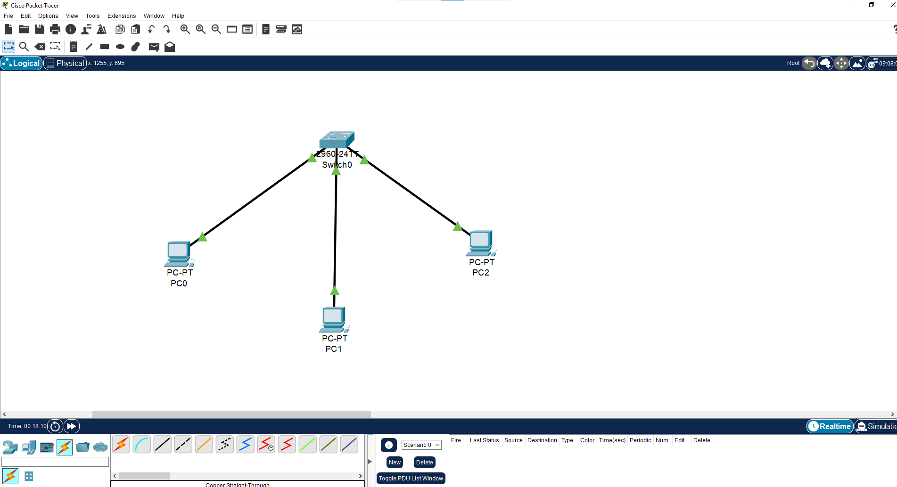
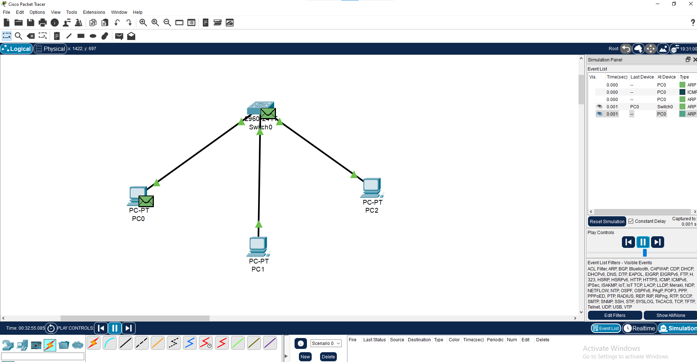
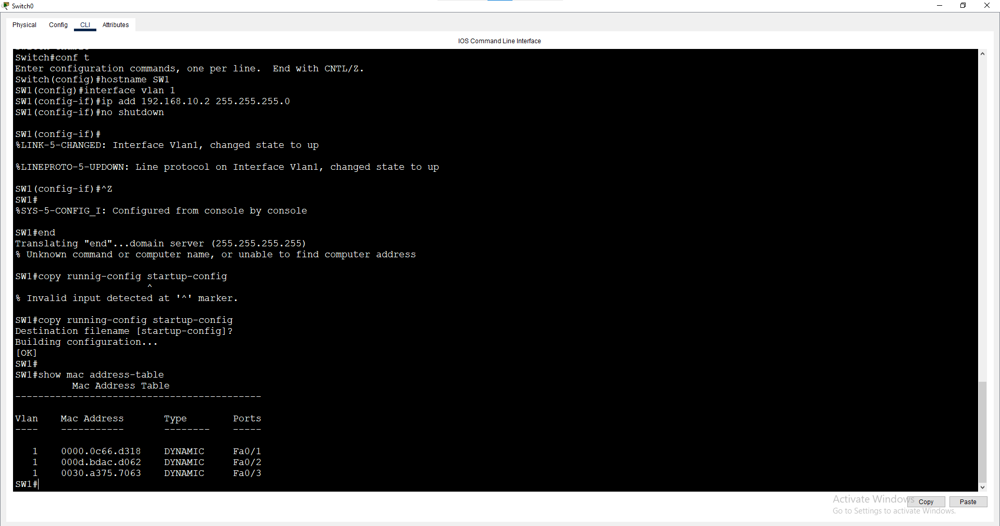

# Lab 2: Connecting PCs, Ping & ARP

**Week 1 - Lab 2** | Topic: Network Fundamentals & Addressing

## Objective
Connect three PCs to a switch, verify connectivity with `ping`, and understand how ARP maps IP addresses to MAC addresses and how a switch learns MAC addresses.

## Topology


`PC1, PC2, PC3 --- SW1`

## Addressing Table
| Device | Interface | IP Address    | Subnet Mask   |
|--------|-----------|---------------|---------------|
| PC1    | NIC       | 192.168.10.10 | 255.255.255.0 |
| PC2    | NIC       | 192.168.10.11 | 255.255.255.0 |
| PC3    | NIC       | 192.168.10.12 | 255.255.255.0 |
| SW1    | VLAN 1    | 192.168.10.2  | 255.255.255.0 |

## Steps

### 1. Configure the switch
```
enable
configure terminal
hostname SW1
interface vlan 1
 ip address 192.168.10.2 255.255.255.0
 no shutdown
 exit
end
copy running-config startup-config
```
| Command | Purpose |
|---------|---------|
| `enable` | Enter privileged EXEC mode |
| `configure terminal` | Enter global configuration mode |
| `interface vlan 1` | Select the switch virtual interface used for management |
| `ip address ...` | Assign the management IP |
| `no shutdown` | Enable the interface |
| `copy running-config startup-config` | Save the configuration |

### 2. Configure the PCs
Set the IP address and mask from the addressing table (Desktop > IP Configuration). No gateway is needed because all devices are on the same subnet.

### 3. Test connectivity
From PC1:
```
ping 192.168.10.11
ping 192.168.10.12
ping 192.168.10.2
```
`ping` sends ICMP Echo Requests and waits for replies. The first ping may time out while ARP resolves the destination MAC address.

### 4. Inspect the ARP table
```
arp -a
```
Shows the IP-to-MAC mappings the PC has learned.

Clear the table and repeat the test:
```
arp -d
ping 192.168.10.11
arp -a
```
`arp -d` deletes all entries, forcing the PC to send a new ARP request.

### 5. Observe ARP in Simulation Mode
1. Switch Packet Tracer to **Simulation** mode.
2. On PC1 run `arp -d`, then `ping 192.168.10.11`.
3. Press Play and observe the ARP Request (broadcast `FFFF.FFFF.FFFF`), the ARP Reply from PC2, and then the ICMP packets.



### 6. Check the switch MAC address table
```
show mac address-table
show ip interface brief
```
- `show mac address-table` lists the MAC addresses learned and the port each one was learned on.
- `show ip interface brief` summarizes interface status and IP addresses.

## Verification
| Command | Run on | Expected result |
|---------|--------|-----------------|
| `ping 192.168.10.11` / `.12` / `.2` | PC1 | Replies, 0% loss |
| `arp -a` | PC1 | Entries for the pinged hosts |
| `show mac address-table` | SW1 | 3 dynamic MAC addresses on Fa0/1 - Fa0/3 |
| `show ip interface brief` | SW1 | VLAN 1 is `up/up` with 192.168.10.2 |



## Common Issues & Fixes
| Problem | Likely cause | Fix |
|---------|--------------|-----|
| First ping times out | ARP resolution on the first packet | Normal, ping again |
| Ping fails to a PC | Wrong IP/mask or link is down | Check the addressing table and port LEDs |
| MAC table is empty | No traffic yet | Generate traffic with ping, then check again |
| Cannot ping the switch | VLAN 1 is shut down | Run `no shutdown` on `interface vlan 1` |

## Files
- [Download Packet Tracer Lab](./lab%202.pkt)


## Lessons Learned
- ARP resolves an IP address to a MAC address using a broadcast request and a unicast reply.
- Switches learn MAC addresses from the source address of incoming frames and forward frames only to the correct port.
- Clearing the ARP cache (`arp -d`) is a quick way to observe ARP behavior again.
