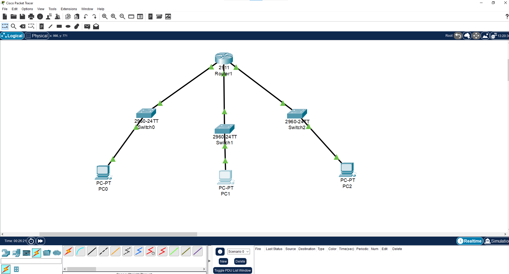
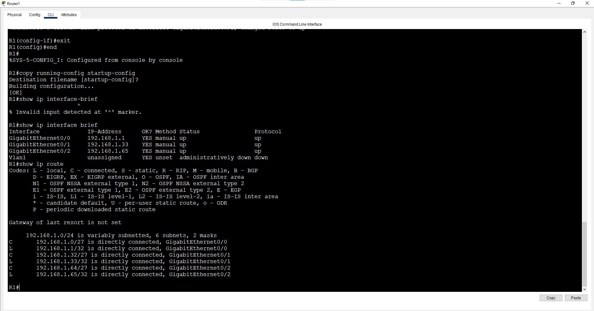
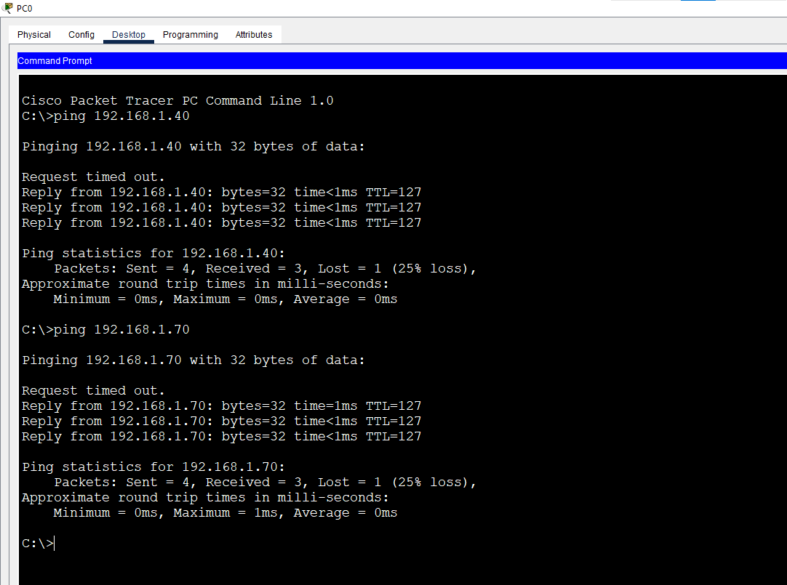

# Lab 3: IPv4 Subnetting (/24 to /27)

**Week 1 - Lab 3** | Topic: Network Fundamentals & Addressing

## Objective
Understand how a single IPv4 network is divided into smaller subnets, calculate network/host/broadcast addresses by hand, and apply three /27 subnets in Packet Tracer with a router connecting them.

## Subnetting Theory

| Prefix | Subnet Mask     | Block Size | Usable Hosts | Subnets from a /24 |
|--------|-----------------|------------|--------------|--------------------|
| /24    | 255.255.255.0   | 256        | 254          | 1                  |
| /25    | 255.255.255.128 | 128        | 126          | 2                  |
| /26    | 255.255.255.192 | 64         | 62           | 4                  |
| /27    | 255.255.255.224 | 32         | 30           | 8                  |

**Formulas**
- Usable hosts = 2^h - 2 (h = host bits; the network and broadcast addresses are not usable)
- Number of subnets = 2^s (s = borrowed bits)
- Block size = 256 - last mask octet

**Method**
1. Read the prefix and calculate the block size.
2. Network address = the largest multiple of the block size that does not exceed the host's octet.
3. Broadcast = network + block size - 1.
4. First host = network + 1, last host = broadcast - 1.

## 192.168.1.0/24 Split into /27 Subnets

| #  | Network        | First Host | Last Host | Broadcast |
|----|----------------|------------|-----------|-----------|
| 0  | 192.168.1.0    | .1         | .30       | .31       |
| 1  | 192.168.1.32   | .33        | .62       | .63       |
| 2  | 192.168.1.64   | .65        | .94       | .95       |
| 3  | 192.168.1.96   | .97        | .126      | .127      |
| 4  | 192.168.1.128  | .129       | .158      | .159      |
| 5  | 192.168.1.160  | .161       | .190      | .191      |
| 6  | 192.168.1.192  | .193       | .222      | .223      |
| 7  | 192.168.1.224  | .225       | .254      | .255      |

## Paper Exercises

| Address            | Network | First Host | Last Host | Broadcast |
|--------------------|---------|------------|-----------|-----------|
| 192.168.1.77/27    | .64     | .65        | .94       | .95       |
| 192.168.1.200/27   | .192    | .193       | .222      | .223      |
| 192.168.1.100/26   | .64     | .65        | .126      | .127      |
| 192.168.1.130/25   | .128    | .129       | .254      | .255      |
| 192.168.1.45/27    | .32     | .33        | .62       | .63       |
| 192.168.1.150/26   | .128    | .129       | .190      | .191      |
| 192.168.1.200/25   | .128    | .129       | .254      | .255      |

## Topology


`PC1 --- SW1 --- R1 (G0/0)`, `PC2 --- SW2 --- R1 (G0/1)`, `PC3 --- SW3 --- R1 (G0/2)`

## Addressing Table
| Device | Interface | IP Address   | Subnet Mask     | Gateway     |
|--------|-----------|--------------|-----------------|-------------|
| R1     | G0/0      | 192.168.1.1  | 255.255.255.224 | N/A         |
| R1     | G0/1      | 192.168.1.33 | 255.255.255.224 | N/A         |
| R1     | G0/2      | 192.168.1.65 | 255.255.255.224 | N/A         |
| PC1    | NIC       | 192.168.1.10 | 255.255.255.224 | 192.168.1.1 |
| PC2    | NIC       | 192.168.1.40 | 255.255.255.224 | 192.168.1.33|
| PC3    | NIC       | 192.168.1.70 | 255.255.255.224 | 192.168.1.65|

## Steps

### 1. Configure the router interfaces
```
enable
configure terminal
hostname R1
interface g0/0
 description LAN-A
 ip address 192.168.1.1 255.255.255.224
 no shutdown
 exit
interface g0/1
 description LAN-B
 ip address 192.168.1.33 255.255.255.224
 no shutdown
 exit
interface g0/2
 description LAN-C
 ip address 192.168.1.65 255.255.255.224
 no shutdown
 exit
end
copy running-config startup-config
```
| Command | Purpose |
|---------|---------|
| `description` | Adds a label to the interface (documentation only) |
| `ip address ...` | Assigns the interface IP and subnet mask |
| `no shutdown` | Enables the interface |
| `copy running-config startup-config` | Saves the configuration |

The switches need no configuration; they only forward frames at Layer 2.

### 2. Configure the PCs
Set the IP address, mask and default gateway from the addressing table.

## Verification
| Command | Run on | Expected result |
|---------|--------|-----------------|
| `show ip interface brief` | R1 | G0/0, G0/1, G0/2 are `up/up` with the correct IPs |
| `show ip route` | R1 | Three `C` (connected) routes: .0/27, .32/27, .64/27 |
| `ping 192.168.1.40` | PC1 | Replies from PC2 |
| `ping 192.168.1.70` | PC1 | Replies from PC3 |




## Intentional Error Test
Setting PC2's gateway to `192.168.1.1` (outside its own subnet) and pinging PC1 fails, because a default gateway must be on the same subnet as the host. Restoring `192.168.1.33` fixes it.

## Common Issues & Fixes
| Problem | Likely cause | Fix |
|---------|--------------|-----|
| Ping between subnets fails | Wrong gateway on a PC | Use the router interface IP of that PC's own subnet |
| Interface is down | Missing `no shutdown` or wrong cable | Enable the interface and check the link |
| Router rejects the IP | Overlapping subnets | Make sure each interface is in a different subnet |
| Wrong network/broadcast answers | Used the wrong block size | Read the prefix first, then calculate the block size |

## Files
- [Download Packet Tracer Lab](./lab%203.pkt)
## Lessons Learned
- Always read the prefix first, then calculate the block size; mixing /25 and /27 block sizes gives wrong answers.
- The network and broadcast addresses of each subnet cannot be assigned to hosts.
- A host's default gateway must be inside its own subnet, and the router interface in that subnet is the usual choice.
- A router needs each interface in a separate subnet to route between them.
